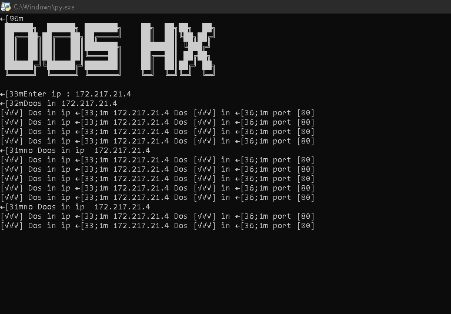

# dosattacks

 
 
.It is a tool to make a dos attack on server links by using a large number of bot net to block the site

## Program Advantages
- features :
   * [X] Dos attack quickly
   * [X] A DDoS attack worked with a large number of botnets
   * [X] dos attack using ip
   * [ ] Dos attack using domain
